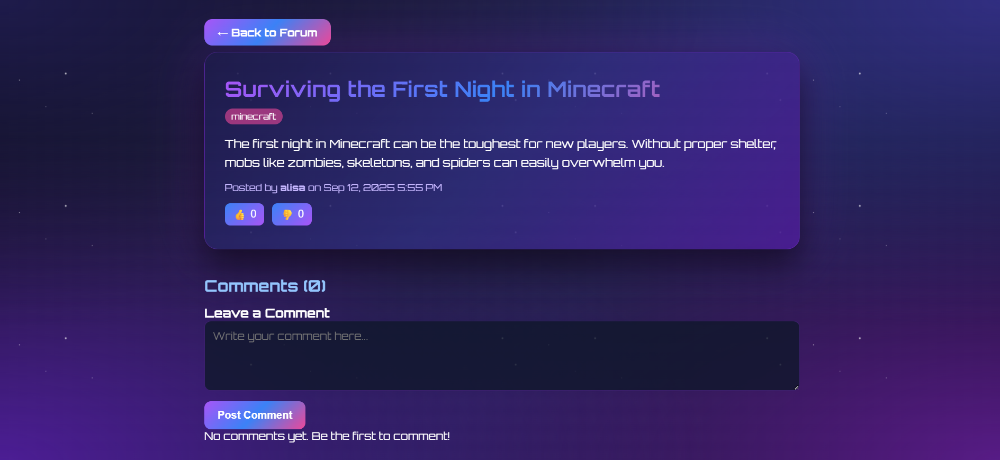
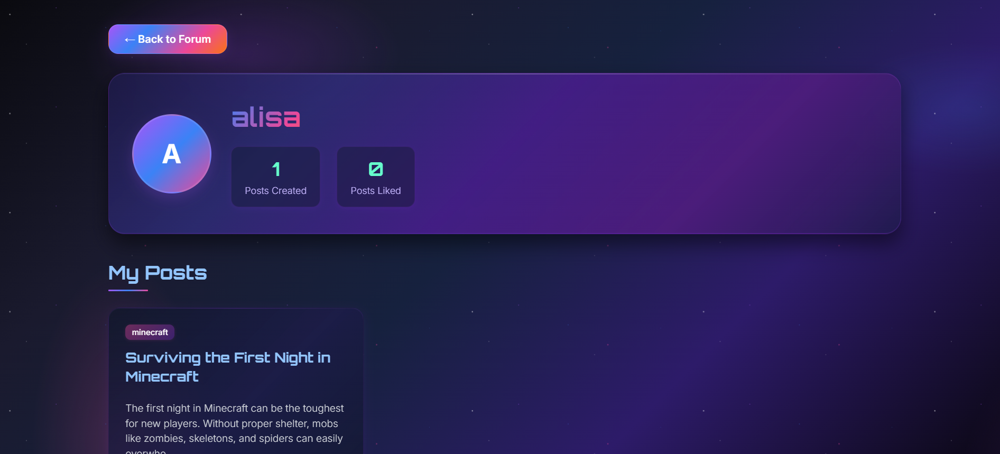

# 🎮 Gaming Forum

## 📸 Screenshots

### 🏠 Homepage


### 📝 Post Page


### 👤 Profile Page



## 📖 Project Overview
A web-based forum for gamers to discuss various game genres, share posts, and interact with each other.  
The platform allows players to connect through posts, comments, likes, and private profiles — all styled with a galaxy theme, gaming-inspired theme.

---

## 🚀 Features
- 👤 **User registration & login** (secure authentication with bcrypt)
- 📝 **Post creation and commenting** for discussions
- 👍 **Like system** for posts and comments
- 🗂️ **Multiple categories**: General, Minecraft, Souls, Online, Story
- 🧑 **User profiles** with account details
- 🌌 **Responsive frontend** with custom backgrounds for each page
- 🐳 **Dockerized deployment** for easy setup and running

---

## 🛠️ Technologies Used
- **Backend:** Go (Golang)
- **Frontend:** HTML, CSS (custom, responsive design)
- **Database:** SQLite
- **Containerization:** Docker

---

## ⚙️ Setup Instructions

### ✅ Prerequisites
- [Go](https://go.dev/dl/) (1.20+ recommended)
- [Docker](https://www.docker.com/) (optional, for containerized deployment)
- Git

### 🔧 Running Locally
1. Clone the repository:
   ```sh
   git clone https://github.com/yourusername/gaming-forum.git
   cd gaming-forum

2. Run the backend:
   ```sh
   go run main.go
   
3. Open your browser and visit:
   ```sh
   http://localhost:8888